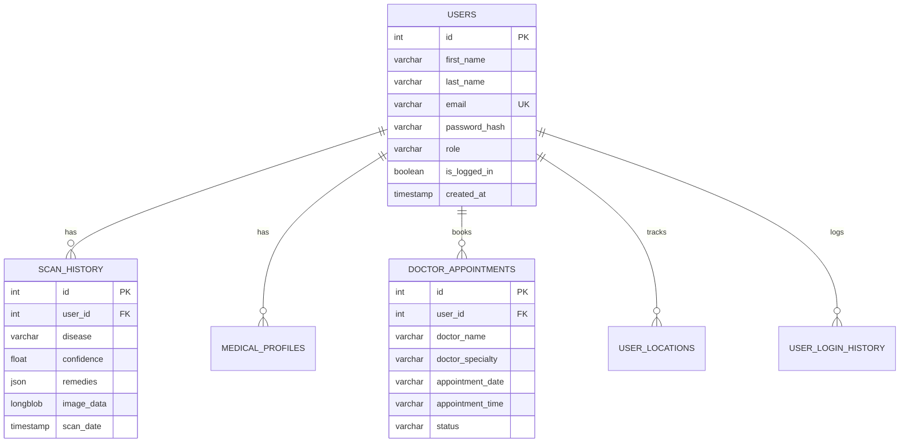

<p align="center">
  
  
  
  
  
  
</p>

<h1 align="center">🩺 DermaCare AI</h1>
<h3 align="center">AI-Based Skin Disease Detection System</h3>

<p align="center">
  A full-stack health-tech web application that leverages deep learning to analyze skin condition images and provide real-time diagnostic insights, nearby dermatologist recommendations, and appointment booking — all wrapped in a premium, modern UI with custom AI-generated branding.
</p>

---

## ✨ Key Features

| Feature | Description |
|---|---|
| 🤖 **AI Skin Analysis** | Real-time skin disease classification using EfficientNetV2 with confidence scoring and top-3 prediction breakdown |
| 🔐 **Secure Authentication** | JWT-based login/register system with bcrypt password hashing, session tracking, and OTP verification |
| 🛡️ **Code Quality & Security** | SonarQube verified 0-issue clean architecture with deep security hardening and Subresource Integrity (SRI) |
| 📊 **Admin Dashboard** | Full admin panel with real-time user management, scan history, login tracking, and system logs |
| 🗺️ **Find Dermatologists** | Geolocation-powered nearby dermatologist search using OpenStreetMap/Overpass API with interactive Leaflet maps |
| 📅 **Appointment Booking** | Complete doctor appointment booking workflow with date/time selection and confirmation |
| 📜 **Scan History** | Persistent scan history with Base64 image storage, confidence tracking, and detailed remedy reports |
| 👤 **User Profiles** | Medical profile management with symptom tracking and health history |
| 🎨 **Premium UI/UX** | Modern glassmorphism design, smooth animations, responsive layout, and dark-mode inspired aesthetics |
| 🖼️ **Custom Logo & Favicon** | AI-generated professional logo used as favicon across all pages for cohesive brand identity |

---

## 🧠 Supported Skin Conditions

The AI model can classify **8 skin conditions** with detailed remedies for each:

| # | Condition | Severity |
|---|-----------|----------|
| 1 | **Acne** | Moderate |
| 2 | **Eczema** | Moderate–High |
| 3 | **Psoriasis** | Moderate–High |
| 4 | **Vitiligo** | Moderate |
| 5 | **Benign Tumor** | Low (Monitor) |
| 6 | **Malignant Tumor** | 🔴 Critical |
| 7 | **Normal Skin** | ✅ Healthy |
| 8 | **Non-Acne Lesion** | Low |

Each diagnosis includes:
- 🏠 Home remedies
- 🧴 Skincare routine recommendations
- 🥗 Diet suggestions
- 🩺 Doctor consultation criteria

---

## 🏗️ Technical Architecture

```
┌─────────────────────────────────────────────────────────────┐
│                        FRONTEND                             │
│  ┌──────────┐  ┌──────────┐  ┌──────────┐                  │
│  │  User UI │  │ Admin UI │  │ Shared   │                  │
│  │ (HTML/JS)│  │ (HTML/JS)│  │(Header/  │                  │
│  │          │  │          │  │ Footer)  │                  │
│  └────┬─────┘  └────┬─────┘  └──────────┘                  │
│       │              │                                      │
│       └──────┬───────┘                                      │
│              │  REST API (JSON)                             │
├──────────────┼──────────────────────────────────────────────┤
│              │           BACKEND (FastAPI)                   │
│  ┌───────────▼───────────┐                                  │
│  │   Routes / Middleware │ ← JWT Auth Guard                 │
│  ├───────────────────────┤                                  │
│  │     Controllers       │ ← Request validation             │
│  ├───────────────────────┤                                  │
│  │      Services         │ ← Business logic                 │
│  ├───────────────────────┤                                  │
│  │    DAO (Data Access)  │ ← MySQL queries                  │
│  ├───────────────────────┤                                  │
│  │   AI Prediction       │ ← EfficientNetV2 (.h5)          │
│  └───────────┬───────────┘                                  │
│              │                                              │
├──────────────┼──────────────────────────────────────────────┤
│              ▼                                              │
│         MySQL Database (dermacare_db)                       │
│   users │ scan_history │ medical_profiles │ appointments    │
│   login_history │ user_locations │ otp_verifications        │
└─────────────────────────────────────────────────────────────┘
```

### Backend Stack
- **FastAPI** — High-performance async Python web framework
- **TensorFlow/Keras** — EfficientNetV2 model for image classification
- **MySQL** — Relational database with connection pooling
- **JWT + Bcrypt** — Secure authentication and password hashing
- **Jinja2** — Server-side template rendering with base template inheritance

### Frontend Stack
- **Vanilla HTML/CSS/JS** — No framework dependency, fully custom
- **Jinja2 Templating** — `base.html` master layout for DRY, consistent head/favicon across all pages
- **Leaflet.js** — Interactive maps for dermatologist discovery
- **Font Awesome** — Icon library (self-hosted)
- **Inter (self-hosted)** — Modern typography, no external font dependency

---

## 📂 Project Structure

```
AI-Based-Skin-Disease-Detection-System/
│
├── main.py                          # Application entry point
├── Dockerfile                       # Container build definition
│
├── backend/
│   ├── app/
│   │   ├── main.py                  # FastAPI app setup, routes & static mounts
│   │   ├── config/
│   │   │   ├── database.py          # MySQL connection pool singleton
│   │   │   └── settings.py          # Environment configuration
│   │   ├── routes/                  # API endpoint definitions
│   │   │   ├── auth_routes.py       # Login, Register, Logout, OTP
│   │   │   ├── scan_routes.py       # Scan history CRUD
│   │   │   ├── predict_routes.py    # AI prediction endpoint
│   │   │   ├── user_routes.py       # User profile & appointments
│   │   │   └── admin_routes.py      # Admin management endpoints
│   │   ├── controllers/             # Request handling & validation
│   │   ├── services/                # Business logic layer
│   │   ├── dao/                     # Data Access Objects (SQL queries)
│   │   ├── middleware/
│   │   │   └── auth_middleware.py   # JWT token verification
│   │   ├── schemas/                 # Pydantic request/response models
│   │   ├── models/                  # ML model files (.h5)
│   │   └── utils/
│   │       ├── remedies.py          # Disease → remedy mapping
│   │       ├── logger.py            # Application logging
│   │       └── image_upload.py      # Image processing utilities
│   └── .env                         # Environment variables (not in git)
│
├── frontend/
│   ├── user/
│   │   ├── templates/               # User-facing HTML pages (extend base.html)
│   │   │   ├── index.html           # Home page (with animated splash screen)
│   │   │   ├── login.html           # Authentication
│   │   │   ├── register.html        # User registration
│   │   │   ├── detection.html       # AI scanner (upload/camera)
│   │   │   ├── scan_result.html     # Analysis results display
│   │   │   ├── history.html         # Scan history dashboard
│   │   │   ├── booking_appointment.html
│   │   │   ├── confirm_booking.html
│   │   │   ├── nearby_dermatologist.html
│   │   │   └── profile.html         # User medical profile
│   │   └── static/
│   │       ├── css/                 # User stylesheets
│   │       └── js/                  # User JavaScript logic
│   │
│   ├── admin/
│   │   ├── templates/
│   │   │   └── dashboard.html       # Admin control panel
│   │   └── static/
│   │       ├── css/admin.css
│   │       └── js/admin.js
│   │
│   └── shared/
│       ├── templates/
│       │   ├── base.html            # Master layout (favicon, CSS, JS imports)
│       │   ├── header.html          # Reusable nav with logo image
│       │   ├── footer.html
│       │   ├── 404.html
│       │   └── 500.html
│       └── static/
│           ├── css/                 # Shared stylesheets (header, footer, icons)
│           ├── js/                  # Shared JS (API config, header, footer)
│           ├── fonts/               # Self-hosted Inter font
│           ├── img/
│           │   └── logo.png         # ← AI-generated brand logo / favicon
│           └── webfonts/            # Font Awesome webfonts
│
└── database/
    └── schema.sql                   # MySQL table definitions
```

---

## 🛠️ Installation & Setup

### Prerequisites
- **Python 3.10+**
- **MySQL 8.0+** (running on port 3306)
- **pip** (Python package manager)

### Step 1: Clone the Repository

```bash
git clone https://github.com/vensipokiya/AI-Based-Skin-Disease-Detection-System.git
cd AI-Based-Skin-Disease-Detection-System
```

### Step 2: Install Python Dependencies

```bash
pip install -r backend/requirements.txt
```

### Step 3: Set Up the Database

```sql
-- In MySQL shell:
CREATE DATABASE dermacare_db;
USE dermacare_db;
SOURCE database/schema.sql;
```

### Step 4: Configure Environment

Create a `backend/.env` file:

```env
DB_HOST=localhost
DB_PORT=3306
DB_USER=root
DB_PASSWORD=your_mysql_password
DB_NAME=dermacare_db
JWT_SECRET_KEY=your_secret_key_here
SECRET_KEY=your_session_secret_here
```

### Step 5: Add the AI Model

> The trained model file (`skin_disease_efficientnetV2_final.h5`, ~113MB) is excluded from git due to GitHub's size limits.

Place your `.h5` model file in:
```
backend/app/models/skin_disease_efficientnetV2_final.h5
```

### Step 6: Run the Application

```bash
python -m uvicorn backend.app.main:app --reload --port 8000
```

---

## 🐳 Docker Deployment

You can run the entire application securely inside a Docker container:

```bash
# Build the Docker image
docker build -t dermacare-ai .

# Run the container
# Make sure your MySQL is accessible (use --network host on Linux,
# or set DB_HOST=host.docker.internal on Windows/Mac)
docker run -p 8000:8000 --env-file backend/.env dermacare-ai
```

### Docker with docker-compose (recommended for local dev)

```yaml
# docker-compose.yml (create manually)
version: "3.9"
services:
  app:
    build: .
    ports:
      - "8000:8000"
    env_file:
      - backend/.env
    depends_on:
      - db
  db:
    image: mysql:8.0
    environment:
      MYSQL_DATABASE: dermacare_db
      MYSQL_ROOT_PASSWORD: your_password
    ports:
      - "3306:3306"
```

```bash
docker-compose up --build
```

### Step 7: Access the Application

| Page | URL |
|------|-----|
| 🏠 Home | [http://127.0.0.1:8000](http://127.0.0.1:8000) |
| 🔬 AI Scanner | [http://127.0.0.1:8000/detect](http://127.0.0.1:8000/detect) |
| 📜 Scan History | [http://127.0.0.1:8000/history](http://127.0.0.1:8000/history) |
| 🛡️ Admin Panel | [http://127.0.0.1:8000/admin](http://127.0.0.1:8000/admin) |

---

## 🎨 Branding

DermaCare AI uses a custom AI-generated logo placed at:

```
frontend/shared/static/img/logo.png
```

The logo is used as:
- **Browser Favicon** — appears in the tab on all pages (set in `base.html` and `dashboard.html`)
- **Navigation Header Logo** — displayed in the top nav bar (`header.html`)
- **Splash Screen Icon** — shown during the app loading animation (`index.html`)
- **Admin Sidebar Logo** — shown in the admin panel sidebar (`dashboard.html`)

---

## 🔑 Admin Panel Access

The admin dashboard provides full control over the platform:

| Feature | Description |
|---------|-------------|
| 👥 User Management | View, search, and delete user accounts |
| 🔬 Scan Records | Browse all patient scan history with images |
| 🏥 Medical Profiles | View patient symptom reports |
| 📅 Appointments | Monitor all doctor appointment bookings |
| 📍 User Locations | Track geolocation data for nearby doctor searches |
| 🔐 Login History | Real-time session monitoring (Active/Login/Logout) with force-logout capability |
| 📋 System Logs | Audit trail of all system activity |
| 🔑 OTP Records | View OTP verification history |

---

## 🔌 API Endpoints

### Authentication
| Method | Endpoint | Description |
|--------|----------|-------------|
| `POST` | `/api/auth/register` | Create new user account |
| `POST` | `/api/auth/login` | Authenticate user (returns JWT) |
| `POST` | `/api/auth/logout` | End user session |
| `POST` | `/api/auth/send-otp` | Send OTP for verification |
| `POST` | `/api/auth/verify-otp` | Verify OTP code |

### AI Prediction
| Method | Endpoint | Description |
|--------|----------|-------------|
| `POST` | `/api/predict` | Upload image → Get AI diagnosis |

### Scan History
| Method | Endpoint | Description |
|--------|----------|-------------|
| `GET` | `/api/scan/history` | Get user's scan history |
| `DELETE` | `/api/scan/history/{id}` | Delete a scan record |

### User
| Method | Endpoint | Description |
|--------|----------|-------------|
| `POST` | `/api/user/appointments` | Book a doctor appointment |
| `GET` | `/api/user/profile` | Get user profile |

### Admin (Protected)
| Method | Endpoint | Description |
|--------|----------|-------------|
| `GET` | `/api/admin/users` | List all users |
| `DELETE` | `/api/admin/users/{id}` | Delete a user |
| `GET` | `/api/admin/scans` | List all scan records |
| `GET` | `/api/admin/appointments` | List all appointments |
| `GET` | `/api/admin/login-history` | Session monitoring |
| `POST` | `/api/admin/force-logout/{session_id}` | Force logout a session |

---

## 🗄️ Database Schema



---

## 🧪 Tech Specifications

| Component | Technology |
|-----------|------------|
| Language | Python 3.10+ |
| Web Framework | FastAPI |
| AI/ML | TensorFlow, Keras (EfficientNetV2) |
| Database | MySQL 8.0 |
| Authentication | JWT (python-jose) + Bcrypt |
| Frontend | HTML5, CSS3, Vanilla JavaScript |
| Templating | Jinja2 (base template inheritance) |
| Maps | Leaflet.js + OpenStreetMap |
| Icons | Font Awesome 6 (self-hosted) |
| Typography | Inter (self-hosted) |
| Containerization | Docker |

---

## 📋 Changelog

### Latest Updates
- 🖼️ **Favicon & Logo** — Custom AI-generated logo now used as favicon across all pages, nav header, splash screen, and admin sidebar
- 🏗️ **Base Template** — Introduced `base.html` master layout for DRY template inheritance; all pages share consistent favicon, fonts, and script imports
- 🔒 **Security Headers** — Added Content Security Policy (CSP) via meta tag in base template
- 🗺️ **Nearby Dermatologists** — Expanded keyword database with 15 search categories, results up to 15 within 15km radius
- 🧹 **SonarQube** — Resolved all reliability, maintainability, and security issues to achieve 0-issue clean code status

---

## 👥 Contributors

- **Vensi Pokiya**
- Nakshi Patel

---

## ⚖️ License

This project is for **educational and research purposes only**.

> ⚠️ **Medical Disclaimer**: DermaCare AI is NOT a substitute for professional medical advice, diagnosis, or treatment. The AI predictions are for preliminary screening only. Always consult a certified dermatologist for accurate diagnosis and treatment plans.

---
